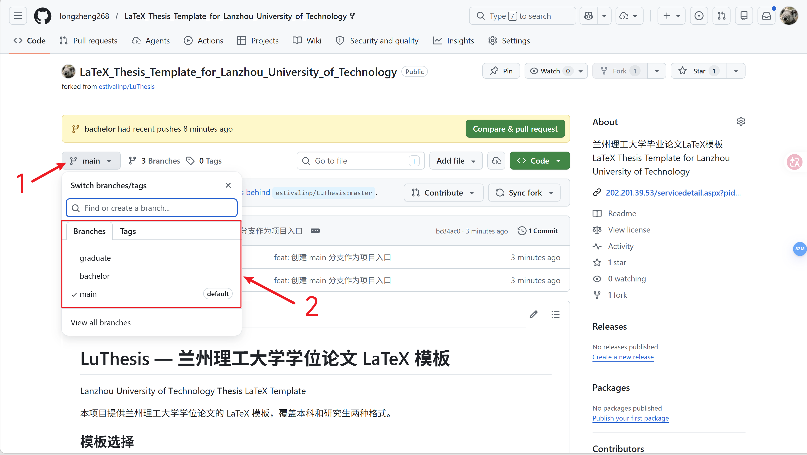

# LuThesis — 兰州理工大学学位论文 LaTeX 模板

**L**anzhou **U**niversity of **T**echnology **Thesis** LaTeX Template

本项目提供兰州理工大学学位论文的 LaTeX 模板，覆盖本科和研究生两种格式。

## 模板选择

本项目包含两个模板，分别位于不同的 Git 分支：

| 分支 | 适用对象 | 说明 |
|------|---------|------|
| [`bachelor`](../../tree/bachelor) | 本科生 | 毕业设计（论文）模板 |
| [`graduate`](../../tree/graduate) | 硕士/博士研究生 | 学位论文模板 |

请根据你的学位类型切换到对应分支获取模板：

```bash
# 克隆仓库
git clone https://github.com/longzheng268/LaTeX_Thesis_Template_for_Lanzhou_University_of_Technology.git
cd LaTeX_Thesis_Template_for_Lanzhou_University_of_Technology

# 本科生使用
git checkout bachelor

# 研究生使用
git checkout graduate
```

或者直接在 GitHub 页面切换分支下载 ZIP。



## 模板特性

- 使用 XeLaTeX 编译，完整支持中文排版
- 所有字体打包在项目 `fonts/` 目录中，换电脑无需额外安装字体
- 封面、页眉、章节标题等格式自动排版，符合学校规范
- 提供公式、图片、表格、算法、列表等完整示例

## 环境要求

- TeX 发行版：MiKTeX 或 TeX Live（2020 及以上版本）
- 编译引擎：XeLaTeX（不支持 pdfLaTeX）
- 编辑器：VSCode + LaTeX Workshop / TeXStudio 等均可

## 编译方式

```bash
xelatex main.tex
xelatex main.tex
```

需要编译两遍以生成正确的目录和交叉引用。

## 各分支详细说明

切换到对应分支后，分支内的 README.md 包含完整的使用指南：

- 个人信息填写方法
- 正文编写（公式、图片、表格、列表）
- 交叉引用
- 字体配置
- 项目结构
- 常见问题

## 致谢

本模板基于清华大学 [ThuThesis](https://github.com/xueruini/thuthesis) v5.3.2 改编，感谢原作者的贡献。

## 许可证

本项目采用 [GNU General Public License v3.0](LICENSE) 开源许可证。
